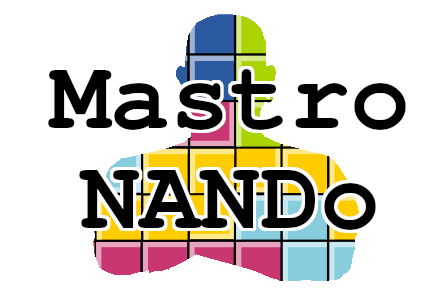

# Mastro NANDo

## Introduction

Mastro NANDo is a [Visual Studio Code](https://code.visualstudio.com/) extension for [Nand2Tetris](https://www.nand2tetris.org/) development based on [Zohar Lee](https://github.com/leafvmaple/)'s ["Nand2Tetris Tools"](https://github.com/leafvmaple/vscode-nand2tetris).
It empowers an incorporated release of the [Nand to Tetris Software Suite](https://www.nand2tetris.org/software) with various Visual Studio Code functionalities. This extension is meant for students, instructors, and self-learners who want to enhance their Nand2Tetris experience.

## Features

### Commands

Name | Icon | Requires Nand to Tetris Software Suite | Description
---- | ---- | ------------------------------- | -----------
Run code |  | ✔︎ | Runs your current file (supports `.hdl`, `.asm`, `hack` and `.vm` files) via CLI. Needs a `.tst` file in the same folder to work.
Stop running | | ✔︎ | Aborts code execution
Translate code |  | ✔︎ | Translate your current file (supports `.asm` and `jack` files) via CLI
Open Hardware Simulator | | ✔︎ | Runs the Hardware Simulator via GUI
Open CPU Emulator | | ✔︎ | Runs the CPU Simulator via GUI
Open VM Emulator | | ✔︎ | Runs the VM Emulator via GUI
Assembler | | ✔︎ | Runs the Assembler via GUI
Compile directory | | ✔︎ | Compiles the directory of your current file (supports `.jack` files)
Zip course source | | | Compresses your solution to a zip archive

### Languages and icon theme

Language | File Extensions | Grammar | Snippets | Icon
-------- | --------------- | ------- | -------- | ----
Hardware Description Language | `.hdl` | ✔︎ | ✔︎ | ✔︎
Test scripts format | `.tst` | ✔︎ | ✔︎ | ✔︎
Compare and output files format | `.cmp`, `.out` | ✔︎ | | ✔︎
Hack Assembly | `.asm` | ✔︎ | ✔︎ | 
Hack Machine Language | `.hack` | ✔︎ | | ✔︎
Hack Virtual Machine Language | `.vm` | ✔︎ | ✔︎ | ✔︎
Jack Language | `.jack` | ✔︎ | ✔︎ | ✔︎

Any icons not listed in the table above have been included in the extension from [VS Code's built-in icon theme Seti](https://github.com/microsoft/vscode/tree/master/extensions/theme-seti).

## User setup

### Prerequisites

1. [Visual Studio Code](https://code.visualstudio.com/Download)

1. [Java Runtime Environment](https://www.java.com/en/download/) (recommended, but needed only if you want to use functionalities related to the Nand to Tetris Software Suite)

There is no need to manually install the Nand to Tetris Software Suite, as it is already incorporated in the extension itself.

### Installation

Please launch VS Code Quick Open (`Ctrl` + `P`), digit `ext install foxyseta.mastro-nando`, and press enter.
You may also visit the [Visual Studio Code Marketplace](https://marketplace.visualstudio.com/items?itemName=foxyseta.mastro-nando) for further support.

## Contributor setup

After cloning this [GitHub repository](https://github.com/foxyseta/mastro-nando), you might want to follow through with the documentation relating [VS Code's Extension API](https://code.visualstudio.com/api).
